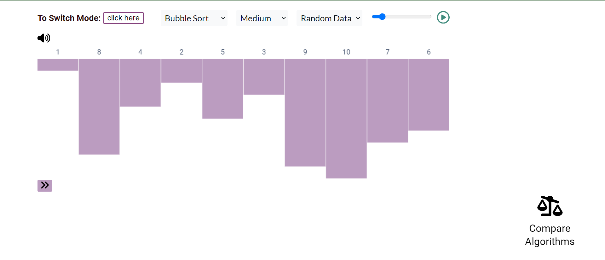
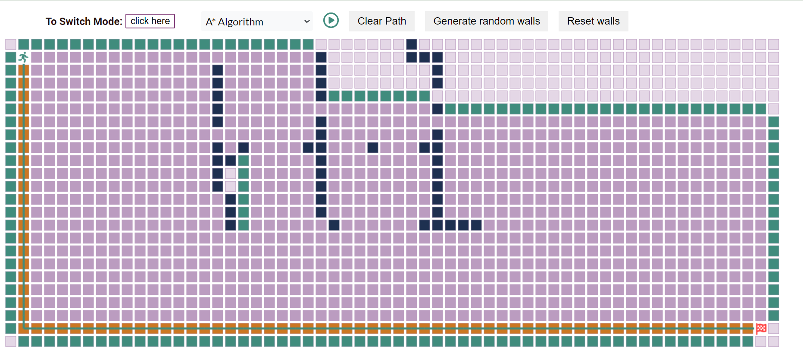

# Sorting and Pathfinding Visualization

This project provides a visual representation of various sorting algorithms and pathfinding algorithms. Users can interact with the visualization to understand the workings of these algorithms.

## Table of Contents

- [Sorting Algorithms](#sorting-algorithms)
- [Pathfinding Algorithms](#pathfinding-algorithms)
- [Usage](#usage)
- [Features](#features)
- [Built With](#built-with)
- [Contributing](#contributing)
- [License](#license)
- [Acknowledgments](#acknowledgments)

## Sorting Algorithms

The project includes visualizations for the following sorting algorithms:

- Bubble Sort
- Selection Sort
- Quick Sort

## Pathfinding Algorithms

The project includes visualizations for the following pathfinding algorithms:

- Dijkstra's Algorithm
- A\* Search Algorithm
- Depth-First Search
- Breadth-First Search

## Usage

1. Clone the repository.
2. Open the `index.html` file in a web browser.
3. Explore sorting and pathfinding visualizations.

## Features

- Interactive visualizations for sorting and pathfinding algorithms.
- Custom user-data/ Random data available for sort algorithm visualization
- Real-time representation of algorithm execution.
- Algorithm efficiency comparison to understand the best-case algorithm for the particular dataset
- Adjustable speed to control the visualization pace.

### Screenshots

_Description: Visualization of the Bubble Sort algorithm in action._

_Description: Visualization of the A_ Search algorithm finding the optimal path.\*

## Built With

- HTML, CSS, JavaScript (Vanilla), Canvas

## Contributing

Contributions are welcome! Feel free to open issues or submit pull requests to enhance the project.

## Acknowledgments

- Inspired by: Clément Mihailescu https://clementmihailescu.github.io/Sorting-Visualizer/
